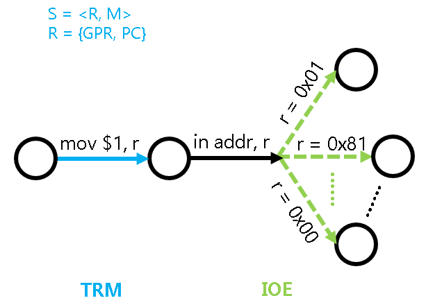

<!-- ## 输入输出 -->
## Input and Output

<!-- 我们已经成功运行了`cpu-tests`中的各个测试用例, 但这些测试用例都只能默默地进行纯粹的计算.
回想起我们在程序设计课上写的第一个程序`hello`, 至少也输出了一行信息.
事实上, 输入输出是计算机与外界交互的基本手段,
如果你还记得计算机刚启动时执行的BIOS程序的全称是Basic Input/Output System,
你就会理解输入输出对计算机来说是多么重要了.
在真实的计算机中, 输入输出都是通过访问I/O设备来完成的. -->
We have successfully run the various test cases in `cpu-tests`, but these test cases can only silently perform pure calculations.
Recalling the first program `hello` we wrote in the programming course, at least it output one line of information.
In fact, input and output are the basic means for computers to interact with the outside world.
If you still remember that the full name of the BIOS program executed when the computer starts up is Basic Input/Output System,
you will understand how important input and output is for computers.
In real computers, input and output are accomplished by accessing I/O devices.

<!-- ### 设备与CPU -->
### Devices and CPU

<!-- 设备的工作原理其实没什么神秘的.
你会在不久的将来在数字电路实验中看到键盘控制器模块和VGA控制器模块相关的verilog代码.
噢, 原来这些设备也一样是个数字电路!
事实上, 只要向设备发送一些有意义的数字信号, 设备就会按照这些信号的含义来工作.
让一些信号来指导设备如何工作, 这不就像"程序的指令指导CPU如何工作"一样吗? 恰恰就是这样!
设备也有自己的状态寄存器(相当于CPU的寄存器), 也有自己的功能部件(相当于CPU的运算器).
当然不同的设备有不同的功能部件,
例如键盘有一个把按键的模拟信号转换成扫描码的部件,
而VGA则有一个把像素颜色信息转换成显示器模拟信号的部件.
控制设备工作的信号称为"命令字", 可以理解成"设备的指令",
设备的工作就是负责接收命令字, 并进行译码和执行...
你已经知道CPU的工作方式, 这一切对你来说都太熟悉了. -->
The working principle of devices is actually not mysterious.
In the near future, you will see the Verilog code related to the keyboard controller module and VGA controller module in the digital circuit experiment.
Oh, it turns out that these devices are also digital circuits!
In fact, as long as some meaningful digital signals are sent to the device, the device will work according to the meaning of these signals.
Isn't it like "the instructions of the program guide how the CPU works" to let some signals guide how the device works? That's exactly it!
Devices also have their own status registers (equivalent to CPU registers) and their own functional units (equivalent to CPU arithmetic units).
Of course, different devices have different functional units,
for example, the keyboard has a component that converts the analog signal of the key press into a scan code,
while the VGA has a component that converts the pixel color information into an analog signal for the display.
The signal that controls the operation of the device is called a "command word", which can be understood as a "device instruction".
The job of the device is to receive the command word and perform decoding and execution...
You already know how the CPU works, all of this is too familiar to you.

<!-- 既然设备是用来进行输入输出的, 所谓的访问设备,
说白了就是从设备获取数据(输入), 比如从键盘控制器获取按键扫描码,
或者是向设备发送数据(输出), 比如向显存写入图像的颜色信息.
但是, 如果万一用户没有敲键盘, 或者是用户想调整屏幕的分辨率, 怎么办呢?
这说明, 除了纯粹的数据读写之外, 我们还需要对设备进行控制:
比如需要获取键盘控制器的状态, 查看当前是否有按键被按下;
或者是需要有方式可以查询或设置VGA控制器的分辨率.
所以, 在程序看来, 访问设备 = 读出数据 + 写入数据 + 控制状态. -->
Since devices are used for input and output, accessing devices is simply to obtain data from devices (input), such as getting key scan codes from the keyboard controller,
or sending data to devices (output), such as writing color information of an image to the video memory.
But what if the user doesn't type on the keyboard, or the user wants to adjust the screen resolution?
This indicates that in addition to pure data reading and writing, we also need to control the devices:
for example, we need to get the status of the keyboard controller to see if a key is currently pressed;
or we need a way to query or set the resolution of the VGA controller.
So, from the perspective of the program, accessing devices = reading data + writing data + controlling status.

<!-- 我们希望计算机能够控制设备, 让设备做我们想要做的事情, 这一重任毫无悬念地落到了CPU身上.
CPU除了进行计算之外, 还需要访问设备, 与其协作来完成不同的任务.
那么在CPU看来, 这些行为究竟意味着什么呢?
具体要从哪里读数据? 把数据写入到哪里? 如何查询/设置设备的状态?
一个最本质的问题是, CPU和设备之间的接口, 究竟是什么? -->
We hope that the computer can control devices and make devices do what we want them to do. This task undoubtedly falls on the CPU.
In addition to performing calculations, the CPU also needs to access devices and cooperate with them to complete different tasks.
So from the CPU's perspective, what do these behaviors actually mean?
Specifically, where should data be read from? Where should data be written to? How to query/set the status of the device?
A fundamental question is, what is the interface between the CPU and devices?

<!-- 答案也许比你想象中的简单很多: 既然设备也有寄存器,
一种最简单的方法就是把设备的寄存器作为接口, 让CPU来访问这些寄存器.
比如CPU可以从/往设备的数据寄存器中读出/写入数据, 进行数据的输入输出;
可以从设备的状态寄存器中读出设备的状态, 询问设备是否忙碌;
或者往设备的命令寄存器中写入命令字, 来修改设备的状态. -->
The answer may be much simpler than you imagine: since devices also have registers,
a simple way is to use the device's registers as the interface and let the CPU access these registers.
For example, the CPU can read/write data from/to the device's data register to perform input/output;
it can read the device's status from the device's status register to ask if the device is busy;
or it can write a command word to the device's command register to modify the device's status.

<!-- 那么, CPU要如何访问设备寄存器呢?
我们先来回顾一下CPU是如何访问CPU自己的寄存器的:
首先给这些寄存器编个号, 比如`eax`是`0`, `ecx`是`1`...
然后在指令中引用这些编号, 电路上会有相应的选择器, 来选择相应的寄存器并进行读写.
对设备寄存器的访问也是类似的:
我们也可以给设备中允许CPU访问的寄存器逐一编号, 然后通过指令来引用这些编号.
设备中可能会有一些私有寄存器, 它们是由设备自己维护的,
它们没有这样的编号, CPU不能直接访问它们. -->
So, how does the CPU access device registers?
Let's first review how the CPU accesses its own registers:
First, we assign a number to these registers, for example, `eax` is `0`, `ecx` is `1`...
Then in the instructions, we reference these numbers, and there will be corresponding selectors on the circuit to select the corresponding register and perform read/write operations.
Accessing device registers is similar:
We can also assign numbers to the registers in the device that the CPU is allowed to access, and then reference these numbers through instructions.
There may be some private registers in the device that are maintained by the device itself,
they do not have such numbers, and the CPU cannot directly access them.

<!-- 这就是所谓的I/O编址方式, 因此这些编号也称为设备的地址. 常用的编址方式有两种. -->
This is called the I/O addressing method, and these numbers are also called device addresses. There are two commonly used addressing methods.

<!-- ### 端口I/O -->
### Port I/O

<!-- 一种I/O编址方式是端口映射I/O(port-mapped I/O), CPU使用专门的I/O指令对设备进行访问,
并把设备的地址称作端口号.
有了端口号以后, 在I/O指令中给出端口号, 就知道要访问哪一个设备寄存器了.
市场上的计算机绝大多数都是IBM PC兼容机,
IBM PC兼容机对常见设备端口号的分配有[专门的规定][io port]. -->
One I/O addressing method is port-mapped I/O, where the CPU uses dedicated I/O instructions to access devices,
and the device address is called the port number.
Once we have the port number, we can specify the port number in the I/O instruction to know which device register to access.
Most computers on the market are IBM PC compatible,
and IBM PC compatible machines have [specific regulations][io port] for allocating port numbers to common devices.

[io port]: https://wiki.osdev.org/I/O_Ports#The_list

<!-- x86提供了`in`和`out`指令用于访问设备,
其中`in`指令用于将设备寄存器中的数据传输到CPU寄存器中,
`out`指令用于将CPU寄存器中的数据传送到设备寄存器中.
一个例子是使用`out`指令给串口发送命令字: -->
x86 provides the `in` and `out` instructions for accessing devices,
where the `in` instruction is used to transfer data from the device register to the CPU register,
and the `out` instruction is used to transfer data from the CPU register to the device register.
An example is using the `out` instruction to send a command word to the serial port:

```asm
movl $0x41, %al
movl $0x3f8, %edx
outb %al, (%dx)
```

<!-- 上述代码把数据0x41传送到0x3f8号端口所对应的设备寄存器中.
CPU执行上述代码后, 会将0x41这个数据传送到串口的一个寄存器中,
串口接收之后, 发现是要输出一个字符`A`;
但对CPU来说, 它并不关心设备会怎么处理0x41这个数据, 只会老老实实地把0x41传送到0x3f8号端口.
事实上, 设备的API及其行为都会在相应的文档里面有清晰的定义,
在PA中我们无需了解这些细节, 只需要知道,
驱动开发者可以通过RTFM, 来编写相应程序来访问设备即可. -->
The above code sends the data 0x41 to the device register corresponding to port 0x3f8.
After the CPU executes the above code, it will send the data 0x41 to one of the serial port's registers.
After receiving it, the serial port will find that it needs to output the character `A`;
but from the CPU's perspective, it doesn't care how the device processes the data 0x41, it will simply send 0x41 to port 0x3f8.
In fact, the API and behavior of the device will be clearly defined in the corresponding documentation.
In PA, we don't need to understand these details, we only need to know that
driver developers can write corresponding programs to access devices by RTFM.

> <!-- #### caution::有没有一种熟悉的感觉?
> API, 行为, RTFM... 没错, 我们又再次看到了计算机系统设计的一个例子:
> 设备向CPU暴露设备寄存器的接口, 把设备内部的复杂行为(甚至一些模拟电路的特性)进行抽象,
> CPU只需要使用这一接口访问设备, 就可以实现期望的功能.
>
> 计算机系统处处蕴含抽象的思想, 只要理解其中的原理,
> 再加上RTFM的技能, 你就能掌握计算机系统的全部! -->
> #### caution::Does this feel familiar?
> API, behavior, RTFM... That's right, we've seen another example of computer system design:
> The device exposes the interface of the device registers to the CPU, abstracting the complex behavior inside the device (even some characteristics of analog circuits).
> The CPU only needs to use this interface to access the device to achieve the desired functionality.
>
> The idea of abstraction is pervasive in computer systems. As long as you understand the principles behind it,
> and add the RTFM skill, you can master all computer systems!

<!-- ### 內存映射I/O -->
### Memory-mapped I/O

<!-- 端口映射I/O把端口号作为I/O指令的一部分, 这种方法很简单, 但同时也是它最大的缺点.
指令集为了兼容已经开发的程序, 是只能添加但不能修改的.
这意味着, 端口映射I/O所能访问的I/O地址空间的大小, 在设计I/O指令的那一刻就已经决定下来了.
所谓I/O地址空间, 其实就是所有能访问的设备的地址的集合.
随着设备越来越多, 功能也越来越复杂, I/O地址空间有限的端口映射I/O已经逐渐不能满足需求了.
有的设备需要让CPU访问一段较大的连续存储空间,
如VGA的显存, 24色加上Alpha通道的1024x768分辨率的显存就需要3MB的编址范围.
于是内存映射I/O(memory-mapped I/O, MMIO)应运而生. -->
Port-mapped I/O takes the port number as part of the I/O instruction, which is a simple method, but also its biggest drawback.
The instruction set, in order to be compatible with already developed programs, can only be added but not modified.
This means that the size of the I/O address space that port-mapped I/O can access is determined at the moment the I/O instruction is designed.
The so-called I/O address space is actually the set of addresses of all accessible devices.
As more and more devices and functions become more and more complex, port-mapped I/O with a limited I/O address space has gradually become unable to meet the demand.
Some devices need the CPU to access a relatively large continuous storage space,
such as the video memory of VGA, which requires a 3MB addressing range for a 1024x768 resolution with 24-bit color plus an Alpha channel.
Hence, memory-mapped I/O (MMIO) was born.

<!-- 内存映射I/O这种编址方式非常巧妙, 它是通过不同的物理内存地址给设备编址的.
这种编址方式将一部分物理内存的访问"重定向"到I/O地址空间中,
CPU尝试访问这部分物理内存的时候, 实际上最终是访问了相应的I/O设备, CPU却浑然不知.
这样以后, CPU就可以通过普通的访存指令来访问设备.
这也是内存映射I/O得天独厚的好处:
物理内存的地址空间和CPU的位宽都会不断增长, 内存映射I/O从来不需要担心I/O地址空间耗尽的问题.
从原理上来说, 内存映射I/O唯一的缺点就是,
CPU无法通过正常渠道直接访问那些被映射到I/O地址空间的物理内存了.
但随着计算机的发展, 内存映射I/O的唯一缺点已经越来越不明显了:
现代计算机都已经是64位计算机, 物理地址线都有48根, 这意味着物理地址空间有256TB这么大,
从里面划出3MB的地址空间给显存, 根本就是不痛不痒. -->
This memory-mapped I/O addressing method is very ingenious, it addresses devices through different physical memory addresses.
This addressing method "redirects" the access to a portion of physical memory to the I/O address space,
when the CPU attempts to access this portion of physical memory, it actually ends up accessing the corresponding I/O device, but the CPU is unaware of this.
After that, the CPU can access devices through ordinary memory access instructions.
This is also the great advantage of memory-mapped I/O:
The physical memory address space and the CPU's bit width will continue to grow, and memory-mapped I/O never needs to worry about the I/O address space being exhausted.
In principle, the only drawback of memory-mapped I/O is that
the CPU cannot directly access the physical memory that is mapped to the I/O address space through normal channels.
However, as computers have developed, the only drawback of memory-mapped I/O has become less and less noticeable:
Modern computers are already 64-bit computers, with 48 physical address lines, meaning the physical address space is as large as 256TB,
carving out a 3MB address space for video memory is just a drop in the bucket.

<!-- 正因为如此, 内存映射I/O成为了现代计算机主流的I/O编址方式:
RISC架构只提供内存映射I/O的编址方式,
而PCI-e, 网卡, x86的APIC等主流设备, 都支持通过内存映射I/O来访问. -->
Precisely because of this, memory-mapped I/O has become the mainstream I/O addressing method for modern computers:
RISC architectures only provide memory-mapped I/O addressing,
and mainstream devices such as PCI-e, network cards, and x86's APIC all support access through memory-mapped I/O.

<!-- 作为RISC架构, mips32和riscv32都是采用内存映射I/O的编址方式.
对x86来说, 内存映射I/O的一个例子是NEMU中的物理地址区间`[0xa1000000, 0xa1800000)`.
这段物理地址区间被映射到VGA内部的显存, 读写这段物理地址区间就相当于对读写VGA显存的数据.
例如 -->
As RISC architectures, both mips32 and riscv32 use the memory-mapped I/O addressing method.
For x86, an example of memory-mapped I/O is the physical address range `[0xa1000000, 0xa1800000)` in NEMU.
This physical address range is mapped to the video memory inside the VGA, reading and writing to this physical address range is equivalent to reading and writing data to the VGA video memory.
For example:

```c
memset((void *)0xa1000000, 0, SCR_SIZE);
```

<!-- 会将显存中一个屏幕大小的数据清零, 即往整个屏幕写入黑色像素, 作用相当于清屏.
可以看到, 内存映射I/O的编程模型和普通的编程完全一样:
程序员可以直接把I/O设备当做内存来访问. 这一特性也是深受驱动开发者的喜爱. -->
This will zero out a screen-sized data in the video memory, i.e., write black pixels to the entire screen, effectively clearing the screen.
We can see that the programming model of memory-mapped I/O is exactly the same as normal programming:
Programmers can directly access I/O devices as if they were memory. This feature is also deeply loved by driver developers.

> <!-- #### question::理解volatile关键字
> 也许你从来都没听说过C语言中有`volatile`这个关键字, 但它从C语言诞生开始就一直存在.
> `volatile`关键字的作用十分特别, 它的作用是避免编译器对相应代码进行优化.
> 你应该动手体会一下`volatile`的作用, 在GNU/Linux下编写以下代码: -->
> #### question::Understanding the volatile keyword
> Perhaps you've never heard of the `volatile` keyword in C, but it has existed since the birth of C.
> The `volatile` keyword has a very special purpose, which is to prevent the compiler from optimizing the corresponding code.
> You should try to experience the effect of `volatile` by writing the following code on GNU/Linux:

```c
void fun() {
  extern unsigned char _end;  // What is _end?
  volatile unsigned char *p = &_end;
  *p = 0;
  while(*p != 0xff);
  *p = 0x33;
  *p = 0x34;
  *p = 0x86;
}
```

> <!-- 然后使用`-O2`编译代码.
> 尝试去掉代码中的`volatile`关键字, 重新使用`-O2`编译, 并对比去掉`volatile`前后反汇编结果的不同.
>
> 你或许会感到疑惑, 代码优化不是一件好事情吗? 为什么会有`volatile`这种奇葩的存在?
> 思考一下, 如果代码中`p`指向的地址最终被映射到一个设备寄存器, 去掉`volatile`可能会带来什么问题? -->
> Then compile the code using `-O2`.
> Try removing the `volatile` keyword from the code, recompile using `-O2`, and compare the differences in the disassembly results before and after removing `volatile`.
>
> You may be puzzled, isn't code optimization a good thing? Why does such a weird thing as `volatile` exist?
> Think about it, if the address that `p` points to in the code is eventually mapped to a device register, what problems might removing `volatile` cause?

<!-- ### 状态机视角下的输入输出 -->
### Input/Output from a State Machine Perspective

<!-- 我们在PA1中提到, 计算机和程序都可以看做一个状态机,
这个状态机的状态可以表示成`S = <R, M>`, 其中`R`是寄存器的状态, `M`是内存的状态.
计算机添加输入输出的功能之后, 我们应该如何理解输入输出的行为呢? -->
In PA1, we mentioned that both computers and programs can be viewed as state machines,
and the state of this state machine can be represented as `S = <R, M>`, where `R` is the state of the registers, and `M` is the state of the memory.
After adding input/output functionality to the computer, how should we understand the behavior of input/output?

<!-- 我们可以把设备分成两部分, 一部分是数字电路.
我们刚才粗略地介绍了一些设备控制器的功能, 例如我们CPU可以从键盘控制器中读出按键信息.
既然是数字电路, 我们就可以把其中的时序逻辑电路看成是设备数字电路部分的状态`D`.
但`D`比较特殊, 计算机只能通过端口I/O指令或者内存映射I/O的访存指令来访问和修改`D`. -->
We can divide the device into two parts, one part is the digital circuit.
We have briefly introduced some functions of device controllers, for example, our CPU can read key information from the keyboard controller.
Since it is a digital circuit, we can treat the sequential logic circuit within it as the state `D` of the digital circuit part of the device.
However, `D` is somewhat special, the computer can only access and modify `D` through port I/O instructions or memory access instructions for memory-mapped I/O.

<!-- 有意思的是设备的另一部分: 模拟电路, 它也可以改变`D`.
例如键盘通过检查按键位置的电容变化来判断是否有按键被按下,
若有, 则会将按键信息写入到键盘控制器的寄存器中.
而按键位置的电容是否发生变化, 又是由物理世界中的用户是否按下按键决定的.
所以我们会说, 设备是连接计算机和物理世界的桥梁. -->
Interestingly, the other part of the device is the analog circuit, which can also change `D`.
For example, the keyboard determines whether a key is pressed by checking the capacitance change at the key position,
if so, it will write the key information to the register of the keyboard controller.
Whether the capacitance at the key position changes or not is determined by whether the user presses the key in the physical world.
So we say that the device is a bridge connecting the computer and the physical world.

<!-- ```
  状态机模型           |           状态机模型之外
  S = <R, M>         |        D
  计算机/程序  ----I/O指令---- 设备 ----模拟电路---- 物理世界
                     |
                     |
``` 
-->

```
  State machine               |           Out side of state machines
  S = <R, M>                  |                D
  computer/program  <----I/O instruction----> device <----analog circuit----> physical world
                              |
                              |
```

<!-- 要对设备的状态和行为进行建模是一件很困难的事情,
除了设备本身的行为五花八门之外, 设备的状态还时时刻刻受到物理世界的影响.
于是, 我们在对状态机模型的行为进行扩展的时候, 并不考虑将`D`加入到`S`中,
而是仅仅对输入输出相关指令的行为进行建模: -->
Modeling the state and behavior of devices is a very difficult task,
not only are the behaviors of devices themselves diverse, but the state of devices is also constantly influenced by the physical world.
Therefore, when extending the behavior of the state machine model, we do not consider adding `D` to `S`,
but only model the behavior of input/output-related instructions:

<!-- * 执行普通指令时, 状态机按照TRM的模型进行状态转移
* 执行设备输出相关的指令(如x86的`out`指令或者RISC架构的MMIO写指令)时,
  状态机除了更新PC之外, 其它状态均保持不变, 但设备的状态和物理世界则会发生相应的变化
* 执行设备输入相关的指令(如x86的`in`指令或者RISC架构的MMIO读指令)时,
  状态机的转移将会"分叉": 状态机不再像TRM那样有唯一的新状态了,
  状态机具体会转移到哪一个新状态, 将取决于执行这条指令时设备的状态 -->
* When executing ordinary instructions, the state machine transitions according to the TRM model
* When executing device output-related instructions (such as the `out` instruction in x86 or the MMIO write instruction in RISC architectures),
  the state machine remains unchanged except for updating the PC, but the state of the device and the physical world will change accordingly
* When executing device input-related instructions (such as the `in` instruction in x86 or the MMIO read instruction in RISC architectures),
  the state machine transition will "branch": the state machine no longer has a unique new state like in the TRM,
  which new state the state machine will transition to will depend on the state of the device when executing this instruction



<!-- 例如, 上图中的程序将要执行指令`in addr, r`,
这条指令将会从设备地址`addr`中读入一个数据到CPU的寄存器`r`中.
不妨假设这个设备地址对应的是某键盘控制器,
执行这条指令之后, `r`中的值可能是`0x01`, 表示读到"按下扫描码为1的按键"的信息;
也可能是`0x81`, 表示读到"释放扫描码为1的按键"的信息;
也可能是`0x0`, 表示没有任何按键信息.
这一步不确定的状态转移会影响到后续程序的运行,
例如某个游戏会根据读入的按键信息决定如何响应,
但不难理解, 游戏如何响应都是通过TRM中普通的计算指令来实现的, 和输入输出没有关系. -->
For example, in the figure above, the program is about to execute the instruction `in addr, r`,
this instruction will read data from the device address `addr` into the CPU register `r`.
Let's assume that this device address corresponds to a keyboard controller,
after executing this instruction, the value in `r` may be `0x01`, indicating that it has read the information "key with scan code 1 is pressed";
it may also be `0x81`, indicating that it has read the information "key with scan code 1 is released";
or it may be `0x0`, indicating that there is no key information.
This uncertain state transition will affect the subsequent execution of the program,
for example, a game may decide how to respond based on the key information read,
but it is not difficult to understand that how the game responds is implemented through ordinary computational instructions in the TRM, and has nothing to do with input/output.

<!-- 这个扩展之后的状态机模型从微观的角度告诉我们, 设备的输入输出都是通过CPU的寄存器来进行数据交互的.
输入输出对程序的影响也仅仅体现在输入时会进行一次不能提前确定的状态转移,
这基本上就是程序眼中输入输出的全部. -->
This extended state machine model tells us from a microscopic perspective that the input and output of devices are all done through data interaction with the CPU registers.
The impact of input/output on the program is only reflected in an uncertain state transition during input,
which is basically all there is to input/output from the program's perspective.

> <!-- #### comment::通过内存进行数据交互的输入输出
> 我们知道`S = <R, M>`, 上文介绍的端口I/O和内存映射I/O都是通过寄存器`R`来进行数据交互的.
> 很自然地, 我们可以考虑, 有没有通过内存`M`来进行数据交互的输入输出方式呢?
>
> 其实是有的, 这种方式叫[DMA][DMA].
> 为了提高性能, 一些复杂的设备一般都会带有DMA的功能.
> 不过在NEMU中的设备都比较简单, 关于DMA的细节我们就不展开介绍了. -->
> #### comment::Input/Output through Memory Data Interaction
> We know that `S = <R, M>`, and the port I/O and memory-mapped I/O introduced above all perform data interaction through the register `R`.
> Naturally, we can consider whether there is an input/output method that performs data interaction through memory `M`.
>
> Actually, there is such a method called [DMA][DMA].
> To improve performance, most complex devices generally have DMA functionality.
> However, the devices in NEMU are relatively simple, so we will not go into the details of DMA.

[DMA]: http://en.wikipedia.org/wiki/Direct_memory_access

<!-- ## NEMU中的输入输出 -->
## Input/Output in NEMU

<!-- NEMU的框架代码已经在`nemu/src/device/`目录下提供了设备相关的代码, -->
The NEMU framework code has already provided device-related code in the `nemu/src/device/` directory,

<!-- ### 映射和I/O方式 -->
### Mapping and I/O Methods

<!-- NEMU实现了端口映射I/O和内存映射I/O两种I/O编址方式.
但无论是端口映射I/O还是内存映射I/O, 它们的核心都是映射.
自然地, 我们可以通过对映射的管理来将这两者统一起来. -->
NEMU implements two I/O addressing methods: port-mapped I/O and memory-mapped I/O.
However, whether it is port-mapped I/O or memory-mapped I/O, their core is mapping.
Naturally, we can unify these two by managing the mapping.

<!-- 具体地, 框架代码为映射定义了一个结构体类型`IOMap`(在`nemu/include/device/map.h`中定义),
包括名字, 映射的起始地址和结束地址, 映射的目标空间, 以及一个回调函数.
然后在`nemu/src/device/io/map.c`实现了映射的管理,
包括I/O空间的分配及其映射, 还有映射的访问接口. -->
Specifically, the framework code defines a structure type `IOMap` (defined in `nemu/include/device/map.h`) for mapping,
including the name, start and end addresses of the mapping, the target space of the mapping, and a callback function.
Then in `nemu/src/device/io/map.c`, the management of mapping is implemented,
including the allocation and mapping of the I/O space, as well as the access interface for mapping.

<!-- 其中`map_read()`和`map_write()`用于将地址`addr`映射到`map`所指示的目标空间, 并进行访问.
访问时, 可能会触发相应的回调函数, 对设备和目标空间的状态进行更新.
由于NEMU是单线程程序, 因此只能串行模拟整个计算机系统的工作,
每次进行I/O读写的时候, 才会调用设备提供的回调函数(callback).
基于这两个API, 我们就可以很容易实现端口映射I/O和内存映射I/O的模拟了. -->
Among them, `map_read()` and `map_write()` are used to map the address `addr` to the target space indicated by `map`, and perform access.
During access, the corresponding callback function may be triggered to update the state of the device and the target space.
Since NEMU is a single-threaded program, it can only simulate the operation of the entire computer system serially,
and the callback function (callback) provided by the device will only be called when performing I/O read/write.
Based on these two APIs, we can easily implement the simulation of port-mapped I/O and memory-mapped I/O.

<!-- `nemu/src/device/io/port-io.c`是对端口映射I/O的模拟.
`add_pio_map()`函数用于为设备的初始化注册一个端口映射I/O的映射关系.
`pio_read()`和`pio_write()`是面向CPU的端口I/O读写接口,
它们最终会调用`map_read()`和`map_write()`, 对通过`add_pio_map()`注册的I/O空间进行访问. -->
`nemu/src/device/io/port-io.c` is the simulation of port-mapped I/O.
The `add_pio_map()` function is used to register a port-mapped I/O mapping relationship for device initialization.
`pio_read()` and `pio_write()` are the port I/O read/write interfaces facing the CPU,
they will eventually call `map_read()` and `map_write()` to access the I/O space registered through `add_pio_map()`.

<!-- 内存映射I/O的模拟是类似的, `paddr_read()`和`paddr_write()`会判断地址`addr`落在物理内存空间还是设备空间,
若落在物理内存空间, 就会通过`pmem_read()`和`pmem_write()`来访问真正的物理内存;
否则就通过`map_read()`和`map_write()`来访问相应的设备.
从这个角度来看, 内存和外设在CPU来看并没有什么不同, 只不过都是一个字节编址的对象而已. -->
The simulation of memory-mapped I/O is similar, `paddr_read()` and `paddr_write()` will determine whether the address `addr` falls in the physical memory space or the device space.
If it falls in the physical memory space, it will access the real physical memory through `pmem_read()` and `pmem_write()`;
otherwise, it will access the corresponding device through `map_read()` and `map_write()`.
From this perspective, memory and peripherals are no different from the CPU's point of view, they are just byte-addressable objects.

<!-- ### 设备 -->
### Devices

<!-- NEMU实现了串口, 时钟, 键盘, VGA, 声卡, 磁盘, SD卡七种设备,
其中磁盘会在PA的最后再进行介绍, 而SD卡在PA中不会涉及.
为了简化实现, 这些设备都是不可编程的, 而且只实现了在NEMU中用到的功能.
为了开启设备模拟的功能, 你需要在menuconfig选中相关选项: -->
NEMU implements seven devices: serial port, clock, keyboard, VGA, sound card, disk, and SD card,
among which the disk will be introduced at the end of PA, and the SD card will not be involved in PA.
To simplify the implementation, these devices are all non-programmable, and only the functions used in NEMU are implemented.
To enable device simulation, you need to select the relevant option in menuconfig:

```
[*] Devices  --->
```

<!-- 重新编译后, 你会看到运行NEMU时会弹出一个新窗口, 用于显示VGA的输出(见下文).
需要注意的是, 终端显示的提示符`(nemu)`仍然在等待用户输入, 此时窗口并未显示任何内容. -->
After recompiling, you will see that a new window will pop up when running NEMU, which is used to display the VGA output (see below).
Note that the prompt `(nemu)` displayed in the terminal is still waiting for user input, and the window does not display any content at this time.

<!-- NEMU使用SDL库来实现设备的模拟, `nemu/src/device/device.c`含有和SDL库相关的代码.
`init_device()`函数主要进行以下工作:
* 调用`init_map()`进行初始化.
* 对上述设备进行初始化, 其中在初始化VGA时还会进行一些和SDL相关的初始化工作,
  包括创建窗口, 设置显示模式等;
* 然后会进行定时器(alarm)相关的初始化工作.
  定时器的功能在PA4最后才会用到, 目前可以忽略它. -->
NEMU uses the SDL library to implement device simulation, and `nemu/src/device/device.c` contains code related to the SDL library.
The `init_device()` function mainly performs the following tasks:
* Call `init_map()` for initialization.
* Initialize the above devices, and during the initialization of VGA, some SDL-related initialization work will also be performed,
  including creating windows, setting display modes, etc.
* Then it will perform initialization work related to the timer (alarm).
  The timer function will not be used until the end of PA4, so it can be ignored for now.

<!-- 另一方面, `cpu_exec()`在执行每条指令之后就会调用`device_update()`函数,
这个函数首先会检查距离上次设备更新是否已经超过一定时间, 若是, 则会尝试刷新屏幕,
并进一步检查是否有按键按下/释放, 以及是否点击了窗口的`X`按钮;
否则则直接返回, 避免检查过于频繁, 因为上述事件发生的频率是很低的. -->
On the other hand, `cpu_exec()` will call the `device_update()` function after executing each instruction.
This function first checks whether a certain amount of time has elapsed since the last device update, if so, it will attempt to refresh the screen,
and further check whether any keys have been pressed/released, and whether the `X` button of the window has been clicked;
otherwise, it will return directly to avoid checking too frequently, because the above events occur at a very low frequency.

<!-- ## 将输入输出抽象成IOE -->
## Abstracting Input/Output into IOE

<!-- 设备访问的具体实现是架构相关的, 比如NEMU的VGA显存位于物理地址区间`[0xa1000000, 0xa1080000)`,
但对`native`的程序来说, 这是一个不可访问的非法区间,
因此`native`程序需要通过别的方式来实现类似的功能.
自然地, 设备访问这一架构相关的功能, 应该归入AM中.
与TRM不同, 设备访问是为计算机提供输入输出的功能,
因此我们把它们划入一类新的API, 名字叫IOE(I/O Extension). -->
The specific implementation of device access is architecture-dependent. For example, NEMU's VGA memory is located in the physical address range `[0xa1000000, 0xa1080000)`, but for `native` programs, this is an inaccessible illegal range. Therefore, `native` programs need to implement similar functionality in other ways. Naturally, this architecture-dependent functionality of device access should be included in AM. Unlike TRM, device access provides input and output functionality for computers, so we categorize them into a new API called IOE (I/O Extension).

<!-- 要如何对不同架构的设备访问抽象成统一的API呢?
回想一下在程序看来, 访问设备其实想做什么:
访问设备 = 读出数据 + 写入数据 + 控制状态.
进一步的, 控制状态本质上也是读/写设备寄存器的操作,
所以访问设备 = 读/写操作. -->
How can we abstract device access across different architectures into a unified API? Recall that from the program's perspective, accessing a device essentially wants to do the following: device access = read data + write data + control state. Furthermore, controlling the state is essentially an operation of reading/writing device registers, so device access = read/write operation.

<!-- 对, 就是这么简单! 所以IOE提供三个API:
```c
bool ioe_init();
void ioe_read(int reg, void *buf);
void ioe_write(int reg, void *buf);
```
第一个API用于进行IOE相关的初始化操作.
后两个API分别用于从编号为`reg`的寄存器中读出内容到缓冲区`buf`中,
以及往编号为`reg`寄存器中写入缓冲区`buf`中的内容.
需要注意的是, 这里的`reg`寄存器并不是上文讨论的设备寄存器, 因为设备寄存器的编号是架构相关的.
在IOE中, 我们希望采用一种架构无关的"抽象寄存器",
这个`reg`其实是一个功能编号, 我们约定在不同的架构中,
同一个功能编号的含义也是相同的, 这样就实现了设备寄存器的抽象. -->
Yes, it's that simple! So IOE provides three APIs:

```c
bool ioe_init();
void ioe_read(int reg, void *buf);
void ioe_write(int reg, void *buf);
```

The first API is for performing IOE-related initialization operations. The latter two APIs are used to read content from the register numbered `reg` into the buffer `buf`, and to write the content of the buffer `buf` into the register numbered `reg`, respectively. Note that the `reg` register here is not the device register discussed earlier, because the numbering of device registers is architecture-dependent. In IOE, we want to adopt an architecture-independent "abstract register". This `reg` is actually a function number, and we agree that the meaning of the same function number is also the same across different architectures, thus achieving the abstraction of device registers.

<!-- `abstract-machine/am/include/amdev.h`中定义了常见设备的"抽象寄存器"编号和相应的结构.
这些定义是架构无关的, 每个架构在实现各自的IOE API时, 都需要遵循这些定义(约定).
为了方便地对这些抽象寄存器进行访问, klib中提供了`io_read()`和`io_write()`这两个宏,
它们分别对`ioe_read()`和`ioe_write()`这两个API进行了进一步的封装. -->
`abstract-machine/am/include/amdev.h` defines the "abstract register" numbers and corresponding structures for common devices. These definitions are architecture-independent, and each architecture needs to follow these definitions (conventions) when implementing its own IOE API. For convenient access to these abstract registers, klib provides the `io_read()` and `io_write()` macros, which further encapsulate the `ioe_read()` and `ioe_write()` APIs, respectively.

<!-- 特别地, NEMU作为一个平台, 设备的行为是与ISA无关的,
因此我们只需要在`abstract-machine/am/src/platform/nemu/ioe/`目录下实现一份IOE, 来供NEMU平台的架构共享.
其中, `abstract-machine/am/src/platform/nemu/ioe/ioe.c`中实现了上述的三个IOE API,
`ioe_read()`和`ioe_write()`都是通过抽象寄存器的编号索引到一个处理函数, 然后调用它.
处理函数的具体功能和寄存器编号相关, 下面我们来逐一介绍NEMU中每个设备的功能. -->
Particularly, as a platform, NEMU's device behavior is ISA-independent. Therefore, we only need to implement one IOE in the `abstract-machine/am/src/platform/nemu/ioe/` directory, which can be shared by all architectures on the NEMU platform. Among them, `abstract-machine/am/src/platform/nemu/ioe/ioe.c` implements the three IOE APIs mentioned above. Both `ioe_read()` and `ioe_write()` index to a handler function based on the abstract register number and then call it. The specific functionality of the handler function is related to the register number. Next, we will introduce the functionality of each device in NEMU one by one.

### Serial Port

<!-- 串口是最简单的输出设备. `nemu/src/device/serial.c`模拟了串口的功能.
其大部分功能也被简化, 只保留了数据寄存器.
串口初始化时会分别注册`0x3F8`处长度为8个字节的端口,
以及`0xa00003F8`处长度为8字节的MMIO空间, 它们都会映射到串口的数据寄存器.
由于NEMU串行模拟计算机系统的工作, 串口的状态寄存器可以一直处于空闲状态;
每当CPU往数据寄存器中写入数据时, 串口会将数据传送到主机的标准错误流进行输出. -->
The serial port is the simplest output device. `nemu/src/device/serial.c` simulates the functionality of the serial port. Most of its functionality is also simplified, leaving only the data register. During serial port initialization, it registers an 8-byte port at `0x3F8` and an 8-byte MMIO space at `0xa00003F8`, both of which are mapped to the serial port's data register. Since NEMU simulates the operation of a computer system in series, the serial port's status register can always be in an idle state; whenever the CPU writes data to the data register, the serial port will send the data to the host's standard error stream for output.

<!-- 事实上, 在`$ISA-nemu`中, 我们之前提到的`putch()`函数, 就是通过串口输出的.
然而AM却把`putch()`放在TRM, 而不是IOE中, 这让人觉得有点奇怪.
的确, 可计算理论中提出的最原始的TRM并不包含输出的能力,
但对于一个现实的计算机系统来说, 输出是一个最基本的功能,
没有输出, 用户甚至无法知道程序具体在做什么.
因此在AM中, `putch()`的加入让TRM具有输出字符的能力,
被扩充后的TRM更靠近一个实用的机器, 而不再是只会计算的数学模型. -->
In fact, in `$ISA-nemu`, the `putch()` function we mentioned earlier is output through the serial port. However, AM puts `putch()` in TRM instead of IOE, which seems a bit strange. Indeed, the most primitive TRM proposed in computational theory does not include the ability to output, but for a real computer system, output is a basic functionality. Without output, the user would not even know what the program is doing. Therefore, in AM, the addition of `putch()` gives TRM the ability to output characters, and the extended TRM is closer to a practical machine rather than just a mathematical model for computation.

<!-- `abstract-machine/am/src/platform/nemu/trm.c`中的`putch()`会将字符输出到串口.
如果你选择了x86, 为了让程序使用串口进行输出, 你还需要在NEMU中实现端口映射I/O. -->
The `putch()` in `abstract-machine/am/src/platform/nemu/trm.c` will output the character to the serial port. If you choose x86, to allow the program to use the serial port for output, you also need to implement port-mapped I/O in NEMU.

> <!-- #### todo::运行Hello World -->
> #### todo::Run Hello World
> <!-- 如果你选择了x86, 你需要实现`in`, `out`指令. 具体地, 你需要RTFSC,
> 然后在`in`指令和`out`指令的实现中正确调用`pio_read()`和`pio_write()`.
> 如果你选择的是mips32和riscv32, 你不需要实现额外的代码,
> 因为NEMU的框架代码已经支持MMIO了. -->
> If you choose x86, you need to implement the `in` and `out` instructions. Specifically, you need to RTFSC, and then correctly call `pio_read()` and `pio_write()` in the implementation of the `in` and `out` instructions. If you choose mips32 or riscv32, you don't need to implement additional code, because the NEMU framework code already supports MMIO.
>
> <!-- 实现后, 在`am-kernels/kernels/hello/`目录下键入
> ```bash
> make ARCH=$ISA-nemu run
> ```
> 如果你的实现正确, 你将会看到程序往终端输出一些信息(请注意不要让输出淹没在调试信息中). -->
> After implementation, enter the following in the `am-kernels/kernels/hello/` directory:
> ```bash
> make ARCH=$ISA-nemu run
> ```
> If your implementation is correct, you will see the program output some information to the terminal (be careful not to let the output be overwhelmed by debug information).
>
> <!-- 需要注意的是, 这个hello程序和我们在程序设计课上写的第一个hello程序所处的抽象层次是不一样的:
> 这个hello程序可以说是直接运行在裸机上, 可以在AM的抽象之上直接输出到设备(串口);
> 而我们在程序设计课上写的hello程序位于操作系统之上,
> 不能直接操作设备, 只能通过操作系统提供的服务进行输出,
> 输出的数据要经过很多层抽象才能到达设备层.
> 我们会在PA3中进一步体会操作系统的作用. -->
> It should be noted that this hello program is at a different level of abstraction from the first hello program we wrote in the programming course: this hello program can be said to run directly on bare metal, and can output directly to devices (serial ports) above the AM abstraction; while the hello program we wrote in the programming course is above the operating system, and cannot directly operate devices, but can only output through services provided by the operating system, and the output data has to go through many layers of abstraction before reaching the device layer. We will further experience the role of the operating system in PA3.

> <!-- #### comment::设备和DiffTest -->
> #### comment::Devices and DiffTest
> <!-- 在状态机视角下, 执行一条输入指令会让状态机的状态转移变得不唯一, 新状态取决于设备的状态.
> 由于NEMU中设备的行为是我们自定义的, 与REF中的标准设备的行为不完全一样
> (例如NEMU中的串口总是就绪的, 但QEMU中的串口也许并不是这样),
> 这导致在NEMU中执行输入指令的结果会和REF有所不同.
> 为了使得DiffTest可以正常工作, 框架代码在访问设备的过程中调用了`difftest_skip_ref()`函数
> (见`nemu/include/device/map.h`中定义的`find_mapid_by_addr()`函数)来跳过与REF的检查. -->
> From the state machine perspective, executing an input instruction causes the state transition of the state machine to become non-unique, with the new state depending on the state of the device. Since the behavior of devices in NEMU is customized by us and is not exactly the same as the behavior of standard devices in REF (for example, the serial port in NEMU is always ready, but the serial port in QEMU may not be), this causes the result of executing input instructions in NEMU to be different from REF. To allow DiffTest to work properly, the framework code calls the `difftest_skip_ref()` function during device access (see the `find_mapid_by_addr()` function defined in `nemu/include/device/map.h`) to skip checking against REF.

<!-- 在AM中, `main()`函数允许带有一个字符串参数, 这一参数通过`mainargs`指定,
并由AM的运行时环境负责将它传给`main()`函数, 供AM程序使用.
具体的参数传递方式和架构相关.
例如你可以在运行`hello`的时候给出一个字符串参数:
```bash
make ARCH=$ISA-nemu run mainargs=I-love-PA
```
这个参数会被`hello`程序原样输出. -->
In AM, the `main()` function allows for a string argument, which is specified by `mainargs` and passed to the `main()` function by the AM runtime environment for use by the AM program. The specific method of passing the argument is architecture-dependent. For example, you can provide a string argument when running `hello`:

```bash
make ARCH=$ISA-nemu run mainargs=I-love-PA
```

This argument will be output verbatim by the `hello` program.

> <!-- #### option::理解mainargs -->
> #### option::Understanding mainargs
> <!-- 请你通过RTFSC理解这个参数是如何从`make`命令中传递到`hello`程序中的,
> `$ISA-nemu`和`native`采用了不同的传递方法, 都值得你去了解一下. -->
> Please RTFSC to understand how this argument is passed from the `make` command to the `hello` program. `$ISA-nemu` and `native` use different passing methods, both of which are worth understanding.

> <!-- #### todo::实现printf -->
> #### todo::Implement printf
> <!-- 有了`putch()`, 我们就可以在klib中实现`printf()`了.
>
> 你之前已经实现了`sprintf()`, 它和`printf()`的功能非常相似,
> 这意味着它们之间会有不少重复的代码.
> 你已经见识到Copy-Paste编程习惯的坏处了, 思考一下, 如何简洁地实现它们呢? -->
> With `putch()`, we can now implement `printf()` in klib.
>
> You have already implemented `sprintf()`, which is very similar in functionality to `printf()`, meaning there will be a lot of duplicated code between them. You have already seen the drawbacks of the copy-paste programming habit. Think about how to implement them concisely.
>
> <!-- 实现了`printf()`之后, 你就可以在AM程序中使用输出调试法了. -->
> After implementing `printf()`, you can use output debugging in AM programs.

> <!-- #### todo::运行alu-tests -->
> #### todo::Run alu-tests
> <!-- 我们在`am-kernels/tests/alu-tests/`目录下移植了一个专门测试各种C语言运算的程序,
> 实现`printf()`后你就可以运行它了. 编译过程可能需要花费1分钟. -->
> We have ported a program specifically for testing various C language operations in the `am-kernels/tests/alu-tests/` directory. After implementing `printf()`, you can run it. The compilation process may take about 1 minute.

<!-- ### 时钟 -->
### Clock

<!-- 有了时钟, 程序才可以提供时间相关的体验, 例如游戏的帧率, 程序的快慢等.
`nemu/src/device/timer.c`模拟了i8253计时器的功能.
计时器的大部分功能都被简化, 只保留了"发起时钟中断"的功能(目前我们不会用到).
同时添加了一个自定义的时钟.
i8253计时器初始化时会分别注册`0x48`处长度为8个字节的端口,
以及`0xa0000048`处长度为8字节的MMIO空间, 它们都会映射到两个32位的RTC寄存器.
CPU可以访问这两个寄存器来获得用64位表示的当前时间. -->
With a clock, programs can provide time-related experiences, such as frame rates and program speed. `nemu/src/device/timer.c` simulates the functionality of the i8253 timer. Most of the timer's functionality has been simplified, leaving only the "initiating clock interrupt" function (which we will not use for now). At the same time, a custom clock has been added. During initialization, the i8253 timer registers an 8-byte port at `0x48` and an 8-byte MMIO space at `0xa0000048`, both of which are mapped to two 32-bit RTC registers. The CPU can access these two registers to obtain the current time represented in 64 bits.

> <!-- #### comment::为什么不设置一个64位的RTC寄存器? -->
> #### comment::Why not set a 64-bit RTC register?
> <!-- 我们希望设备的设计与CPU解耦, 无论设备接入到何种架构的CPU都能工作.
> 但32位的CPU无法一次访问64位的设备寄存器, 因此将一个64位的功能拆分成两个32位的设备寄存器,
> 可同时支持接入32位和64位CPU. -->
> We want the design of devices to be decoupled from the CPU, so that devices can work with any CPU architecture they are connected to. However, a 32-bit CPU cannot access a 64-bit device register at once, so splitting a 64-bit function into two 32-bit device registers can support both 32-bit and 64-bit CPUs.

<!-- `abstract-machine/am/include/amdev.h`中为时钟的功能定义了两个抽象寄存器:
* `AM_TIMER_RTC`, AM实时时钟(RTC, Real Time Clock), 可读出当前的年月日时分秒. PA中暂不使用.
* `AM_TIMER_UPTIME`, AM系统启动时间, 可读出系统启动后的微秒数. -->
`abstract-machine/am/include/amdev.h` defines two abstract registers for clock functionality:
* `AM_TIMER_RTC`, AM Real Time Clock (RTC), which can read the current year, month, day, hour, minute, and second. Not used in PA for now.
* `AM_TIMER_UPTIME`, AM system uptime, which can read the number of microseconds since the system started.

Here is my translation of the given text, following the instructions:

<!-- > #### info::RTC - 实时时钟
> RTC泛指流逝速率与真实时间一致的时钟, 用户可根据RTC进行一段时间的测量.
> 按照这个定义, 上述两个AM抽象寄存器都属于RTC, 不过它们的侧重点有所不同:
> `AM_TIMER_RTC`强调读出的时间与现实时间完全一致,
> `AM_TIMER_UPTIME`则侧重系统启动后经过的时间, 即从0开始计数.
>
> 虽然NEMU中的设备寄存器的名称也叫RTC, 但为了支持`AM_TIMER_UPTIME`的功能,
> 它不必实现成`AM_TIMER_RTC`. -->

> #### info::RTC - Real-Time Clock
> RTC refers to a clock whose elapsed rate is consistent with real time, allowing users to measure a period of time based on the RTC.
> According to this definition, both of the above AM abstract registers are RTCs, but they have different emphases:
> `AM_TIMER_RTC` emphasizes that the read time is completely consistent with real time,
> while `AM_TIMER_UPTIME` emphasizes the time elapsed since the system started, i.e., counting from 0.
>
> Although the device register in NEMU is also called RTC, it does not need to be implemented as `AM_TIMER_RTC` to support the `AM_TIMER_UPTIME` functionality.

<!-- > #### todo::实现IOE
> 在`abstract-machine/am/src/platform/nemu/ioe/timer.c`中实现`AM_TIMER_UPTIME`的功能.
> 在`abstract-machine/am/src/platform/nemu/include/nemu.h`和
> `abstract-machine/am/src/$ISA/$ISA.h`中有一些输入输出相关的代码供你使用.
>
> 实现后, 在`$ISA-nemu`中运行`am-kernel/tests/am-tests`中的`real-time clock test`测试.
> 如果你的实现正确, 你将会看到程序每隔1秒往终端输出一行信息.
> 由于我们没有实现`AM_TIMER_RTC`, 测试总是输出1900年0月0日0时0分0秒,
> 这属于正常行为, 可以忽略. -->

> #### todo::Implement IOE
> Implement the `AM_TIMER_UPTIME` functionality in `abstract-machine/am/src/platform/nemu/ioe/timer.c`.
> There is some input/output related code available for you to use in `abstract-machine/am/src/platform/nemu/include/nemu.h` and `abstract-machine/am/src/$ISA/$ISA.h`.
>
> After implementation, run the `real-time clock test` in `am-kernel/tests/am-tests` under `$ISA-nemu`.
> If your implementation is correct, you will see the program output a line to the terminal every second.
> Since we have not implemented `AM_TIMER_RTC`, the test will always output January 0, 1900, 0:00:00, which is normal behavior and can be ignored.

<!-- > #### hint::不要在native链接到klib时运行IOE相关的测试
> `native`的IOE是基于SDL库实现的, 它们假设常用库函数的行为会符合glibc标准,
> 但我们自己实现的klib通常不能满足这一要求. 因此`__NATIVE_USE_KLIB__`仅供测试klib实现的时候使用,
> 我们不要求在定义`__NATIVE_USE_KLIB__`的情况下正确运行所有程序. -->

> #### hint::Do not run IOE-related tests when linking to klib on native
> The IOE on `native` is implemented based on the SDL library, which assumes that the behavior of common library functions will conform to the glibc standard.
> However, our own implementation of klib usually cannot meet this requirement. Therefore, `__NATIVE_USE_KLIB__` is only for testing the klib implementation, and we do not require all programs to run correctly when `__NATIVE_USE_KLIB__` is defined.

<!-- > #### caution::RTFSC尽可能了解一切细节
> 经常有同学反馈自己阅读代码的经验很少, 没见过好的代码怎么写.
> 但另一方面, 这些同学在做实验的时候却只关心究竟在什么地方填写代码,
> 写完就认为自己完成了实验, 从而觉得其它代码和实验内容无关, 不愿意花时间去阅读.
>
> 怀着这种心态的同学其实是主动放弃了锻炼能力的机会.
> 如果你是真心想学习, 你就不应该觉得"这个文件好像不看也行, 关我P事",
> 而是应该主动想"这个程序跑出来的结果是这样, 我来读代码看看它究竟是怎么写的".
> 事实上, 框架代码里面有非常多的宝藏,
> 即使是测试代码, 阅读它们除了能让你明白这些测试的具体行为之外,
> 你还会了解程序应该如何使用AM的API, 甚至是编码风格也有值得你学习的地方.
>
> 因此, 要如何运行`real-time clock test`这个测试, 就交给你来RTFSC吧. -->

> #### caution::RTFSC to understand all the details as much as possible
> Many students often feedback that they have little experience in reading code and have not seen how good code is written.
> On the other hand, these students only care about where to write code when doing experiments, and they think they have completed the experiment once they have written the code, and thus feel that other code and experiment content are irrelevant and are unwilling to spend time reading it.
>
> Students with this attitude are actually actively giving up the opportunity to practice their abilities.
> If you truly want to learn, you should not think "this file seems unnecessary to read, I don't care about it", but should actively think "this is the result of the program running, let me read the code to see how it is actually written".
> In fact, there are many treasures in the framework code, even in the test code. Reading them not only allows you to understand the specific behavior of these tests, but you will also learn how programs should use the AM API, and even the coding style is worth learning.
>
> Therefore, let's leave it to you to RTFSC on how to run the `real-time clock test`.

<!-- > #### todo::看看NEMU跑多快
> 有了时钟之后, 我们就可以测试一个程序跑多快, 从而测试计算机的性能.
> 尝试在NEMU中依次运行以下benchmark(已经按照程序的复杂度排序, 均在`am-kernel/benchmarks/`目录下;
> 另外跑分时请关闭NEMU的监视点, trace以及DiffTest, 同时取消menuconfig中的
> `Enable debug information`并重新编译NEMU, 以获得较为真实的跑分):
> * dhrystone
> * coremark
> * microbench
>
> 成功运行后会输出跑分. 其中microbench跑分以`i9-9900K @ 3.60GHz`的处理器为参照,
> `100000`分表示与参照机器性能相当, `100`分表示性能为参照机器的千分之一.
> 除了和参照机器比较之外, 也可以和小伙伴进行比较.
> 如果把上述benchmark编译到`native`, 还可以比较`native`的性能.
>
> 另外, microbench提供了四个不同规模的测试集, 包括`test`, `train`, `ref`和`huge`.
> 你可以先运行`test`规模, 它可以较快地运行结束, 来检查NEMU实现的正确性,
> 然后再运行`ref`规模来测量性能. 具体的运行方法请阅读README.
>
> 此外, `huge`规模一般用于真机的测试,
> 在NEMU中需要运行很长时间, 我们不要求你运行它. -->

> #### todo::See how fast NEMU runs
> With the clock, we can now test how fast a program runs, and thus test the computer's performance.
> Try running the following benchmarks in NEMU (they are sorted by program complexity and are all in the `am-kernel/benchmarks/` directory; also, when running the benchmarks, please turn off NEMU's watchpoints, trace, and DiffTest, and uncheck `Enable debug information` in menuconfig and recompile NEMU to get a more realistic score):
> * dhrystone
> * coremark
> * microbench
>
> After successful execution, a score will be output. For microbench, the score is based on an `i9-9900K @ 3.60GHz` processor as a reference, where `100000` represents performance equivalent to the reference machine, and `100` represents performance one-thousandth of the reference machine.
> In addition to comparing with the reference machine, you can also compare with your classmates.
> If you compile the above benchmarks to `native`, you can also compare the performance of `native`.
>
> Additionally, microbench provides four different test sets, including `test`, `train`, `ref`, and `huge`.
> You can first run the `test` set, which can finish running relatively quickly, to check the correctness of your NEMU implementation, and then run the `ref` set to measure performance. Please read the README for specific instructions on how to run them.
>
> Furthermore, the `huge` set is generally used for testing on real machines, and it takes a long time to run on NEMU, so we do not require you to run it.

<!-- > #### hint::跑分参考
> 在真机上通过RISC-V的NEMU(按照PA的常规流程开发, 未进行优化)运行microbench的`ref`规模输入,
> 跑分约300~500. 若在虚拟机中运行, 则分数更低一些.
> 若在虚拟机中跑分过低(例如只有几分), 可以尝试在menuconfig
> 中将NEMU所使用的定时器从`gettimeofday()`换成`clock_gettime()`:
> ```
> Miscellaneous
>       Host timer (clock_gettime)
> ```
> 重新编译NEMU后若跑分有明显提升, 则`gettimeofday()`的低性能可能与时钟源(clocksource)相关,
> 可尝试参考[这个帖子](https://stackoverflow.com/questions/42622427/gettimeofday-not-using-vdso)
> 进行调整, 或者重启虚拟机或真机(有同学反映重启可解决问题), 然后切换回`gettimeofday()`并对比性能. -->

> #### hint::Score reference
> Running the `ref` input of microbench on a real machine with the RISC-V NEMU (developed following the regular PA process, without optimization) yields a score of around 300~500. If running in a virtual machine, the score will be lower.
> If the score is too low when running in a virtual machine (e.g., only a few points), you can try changing the timer used by NEMU from `gettimeofday()` to `clock_gettime()` in menuconfig:
> ```
> Miscellaneous
>       Host timer (clock_gettime)
> ```
> If the score improves significantly after recompiling NEMU, the low performance of `gettimeofday()` may be related to the clock source (clocksource). You can try adjusting it by referring to [this post](https://stackoverflow.com/questions/42622427/gettimeofday-not-using-vdso), or by restarting the virtual machine or real machine (some students have reported that restarting can solve the problem), and then switch back to `gettimeofday()` and compare the performance.

> #### caution::How to debug complex programs
> As programs become more and more complex, debugging becomes increasingly difficult, and bugs can become increasingly strange.
> This is almost a pain that every student working on PA must experience: the ability you have trained in the program design course is simply not enough to allow you to write correct programs.
> But after you graduate, you still need to face projects with tens of thousands or even hundreds of thousands of lines of code, compared to which PA is just a small toy.
>
> In PA, we let you face these pains, ultimately hoping that you will understand the true debugging method, so that you can face larger projects in the future:
> 1. <font color=blue>RTFSC</font>. This is to let you understand how all the details happen,
> these details will become useful clues when debugging, because:
> <font color=green>Only when you understand what is "correct" will you know what is "wrong";
> The clearer your understanding of "correct", the deeper your understanding of "wrong" will be.</font>
> <font color=red>Therefore, when you encounter a bug and feel helpless, completely unable to understand how this bug might have occurred,
> it is almost always because you were previously unwilling to RTFSC, thinking it didn't matter if you didn't read it, resulting in you having no usable clues to help you analyze the bug.</font>
> 2. <font color=blue>Use the right tools</font>. The bugs you encounter are strange and varied, but there are always ways to help you solve them efficiently.
> <font color=green>We have introduced a lot of tools and methods in the lecture notes, and they all have their own applicable situations and limitations.</font>
> <font color=red>Therefore, if you have an initial guess about the cause of a bug, but have no idea how to go about debugging it,
> it is almost always because you have not mastered these tools and methods proficiently, resulting in your inability to choose an appropriate debugging plan based on the actual situation,
> or even because you completely ignored them, thinking it didn't matter if you didn't understand them.</font>
> For example, we have already suggested an efficient way to deal with segmentation faults in one of the optional questions,
> if you don't know what to do when you encounter a segmentation fault, and you ignore the above suggestion, you have probably wasted a lot of unnecessary time.
>
> The skills practiced in PA are interconnected, and when you think you can save time by "not carefully reading the code/lecture notes/manuals",
> you will inevitably have to pay more for it in the future: when bugs come, the debt owed will have to be repaid.

<!-- > #### caution::RTFSC了解一切细节
> 关于`AM_TIMER_UPTIME`的实现, 我们在框架代码中埋了一些小坑,
> 如果你没有修复相关的问题, 你可能会在运行benchmark的时候出现跑分不正确的现象.
> 这是为了强迫大家认真RTFSC了解程序运行过程中的一切细节:
> benchmark读取时钟信息的时候, 整个计算机系统究竟发生了什么?
> 只有这样你才能把时钟相关的bug调试正确. -->
> #### caution::RTFSC to understand all details
> Regarding the implementation of `AM_TIMER_UPTIME`, we have planted some small pitfalls in the framework code,
> If you have not fixed the related issues, you may encounter incorrect scoring when running the benchmark.
> This is to force everyone to seriously RTFSC and understand all the details of the program execution process:
> When the benchmark reads the clock information, what exactly happens in the entire computer system?
> Only in this way can you debug the clock-related bugs correctly.

<!-- > #### comment::NEMU和语言解释器
> microbench中有一个叫`bf`的测试项目, 它是[Brainf\*\*k][bf]语言的一个解释器.
> Brainf\*\*k语言非常简单, 它只有8种指令, 连变量的概念都没有, 因此非常接近机器语言.
> 有兴趣的同学可以阅读`bf.c`的代码,
> 你会发现这么简单的一个语言解释器和看上去很复杂的NEMU从原理上来看还是有相似之处的.

[bf]: http://en.wikipedia.org/wiki/Brainfuck -->
> #### comment::NEMU and language interpreters
> In microbench, there is a test project called `bf`, which is an interpreter for the [Brainf\*\*k][bf] language.
> The Brainf\*\*k language is very simple, it only has 8 instructions, and doesn't even have the concept of variables, so it is very close to machine language.
> Students who are interested can read the code of `bf.c`,
> you will find that such a simple language interpreter and the seemingly complex NEMU are still similar in principle.

[bf]: http://en.wikipedia.org/wiki/Brainfuck

<!-- > #### caution::先完成, 后完美 - 抑制住优化代码的冲动
> 计算机系统的设计过程可以概括成两件事:
> 1. 设计一个功能正确的完整系统 (先完成)
> 1. 在第1点的基础上, 让程序运行得更快 (后完美)
>
> 看到跑分之后, 你也许会忍不住去思考如何优化你的NEMU.
> 上述原则告诉你, 时机还没到.
> 一个原因是, 在整个系统完成之前, 你很难判断系统的性能瓶颈会出现在哪一个模块中.
> 你一开始辛辛苦苦追求的完美, 最后对整个系统的性能提升也许只是九牛一毛, 根本不值得你花费这么多时间.
> 比如你可能在PA1中花时间去优化表达式求值的算法, 你可以以此作为一个编程练习,
> 但如果你的初衷是为了优化性能, 你的付出绝对是没有效果的:
> 你得输入多长的表达式才能让你明显感觉到新算法的性能优势?
>
> 此外, PA作为一个教学实验, 只要性能不是差得无法接受,
> 性能都不是你需要考虑的首要目标, 实现方案点到为止即可.
> 相比之下, 通过设计一个完整的系统来体会程序如何运行, 对你来说才是最重要的.
>
> 事实上, 除了计算机, "先完成, 后完美"的原则也适用于很多领域.
> 比如企业方案策划, 大家可以在一个完整但哪怕很简单的方案上迭代;
> 但如果一开始就想着把每一个点都做到完美, 最后很可能连一份完整的方案也拿不出手.
> 论文写作也一样, 哪怕是只有完整的小标题, 大家都可以去检查文章的整体框架有无逻辑漏洞;
> 相反, 就算文章配有再漂亮的实验数据, 在有漏洞的逻辑面前也无法自圆其说.
>
> 随着你参与越来越大的项目, 你会发现让完整的系统正确地跑起来, 会变得越来越难.
> 这时候, 遵循"先完成, 后完美"的原则就显得更重要了:
> 很多问题也许会等到项目趋于完整的时候才会暴露出来,
> 舍弃全局的完整而换来局部的完美, 大多时候只会南辕北辙. -->
> #### caution::Complete first, then perfect - Suppress the urge to optimize code
> The design process of a computer system can be summarized into two things:
> 1. Design a functionally correct and complete system (complete first)
> 2. Based on point 1, make the program run faster (perfect later)
>
> After seeing the scores, you may be tempted to think about how to optimize your NEMU.
> The above principle tells you that the time is not yet ripe.
> One reason is that before the entire system is complete, it is very difficult for you to determine which module the performance bottleneck will occur in.
> The perfection you initially pursued so hard may only be a drop in the bucket for the overall system performance improvement, and is simply not worth your time.
> For example, you may have spent time optimizing the expression evaluation algorithm in PA1, you can take this as a programming exercise,
> but if your original intention was to optimize performance, your efforts will absolutely have no effect:
> How long an expression do you need to input before you can clearly feel the performance advantage of the new algorithm?
>
> Furthermore, as a teaching experiment, PA only requires that the performance is not unacceptably poor,
> performance is not your primary goal to consider, and the implementation solution is just enough.
> In contrast, experiencing how programs run by designing a complete system is most important for you.
>
> In fact, apart from computers, the principle of "complete first, then perfect" also applies to many fields.
> For example, in enterprise solution planning, everyone can iterate on a complete but even very simple solution;
> but if you start out thinking about making every point perfect, you may end up not even having a complete solution.
> The same goes for writing papers, even if there are only complete subheadings, everyone can check the overall framework of the article for logical flaws;
> On the contrary, even if the article has beautiful experimental data, it cannot be self-consistent in the face of flawed logic.
>
> As you participate in larger and larger projects, you will find that getting a complete system to run correctly will become increasingly difficult.
> At this point, following the principle of "complete first, then perfect" becomes even more important:
> Many problems may only be exposed when the project is nearing completion,
> abandoning global completeness for local perfection will often only lead to going around in circles.

<!-- 正确实现时钟后, 你就可以在NEMU上运行一些具有展示性的程序了:
我们在`am-kernels/kernels/demo/`目录下移植了一些小型演示程序:
* `ant` - [兰顿蚂蚁][ant]
* `galton` - [高尔顿钉板][galton]
* `hanoi` - [汉诺塔][hanoi]
* `life` - [生命游戏][game of life]
* `aclock` - 钟表, 需要实现`AM_TIMER_RTC`, NEMU暂不支持
* `cmatrix` - 黑客帝国的代码雨
* `donut` - 3D旋转的甜甜圈
* `bf` - 用Brainf\*\*k程序绘制[曼德勃罗特集合][mandelbrot]的分形图案,
   Brainf\*\*k语言的运行效率较低, 请耐心等待

[ant]: https://en.wikipedia.org/wiki/Langton%27s_ant
[galton]: https://en.wikipedia.org/wiki/Galton_board
[hanoi]: https://en.wikipedia.org/wiki/Tower_of_Hanoi
[game of life]: https://en.wikipedia.org/wiki/Conway%27s_Game_of_Life
[mandelbrot]: https://en.wikipedia.org/wiki/Mandelbrot_set -->

After correctly implementing the clock, you can run some demonstrative programs on NEMU:
We have ported some small demo programs in the `am-kernels/kernels/demo/` directory:
* `ant` - [Langton's ant][ant]
* `galton` - [Galton board][galton]
* `hanoi` - [Tower of Hanoi][hanoi]
* `life` - [Conway's Game of Life][game of life]
* `aclock` - Clock, requires implementing `AM_TIMER_RTC`, not yet supported by NEMU
* `cmatrix` - The code rain from The Matrix
* `donut` - 3D rotating donut
* `bf` - Drawing the [Mandelbrot set][mandelbrot] fractal pattern with a Brainf\*\*k program,
   The Brainf\*\*k language has relatively low execution efficiency, please be patient

[ant]: https://en.wikipedia.org/wiki/Langton%27s_ant
[galton]: https://en.wikipedia.org/wiki/Galton_board
[hanoi]: https://en.wikipedia.org/wiki/Tower_of_Hanoi
[game of life]: https://en.wikipedia.org/wiki/Conway%27s_Game_of_Life
[mandelbrot]: https://en.wikipedia.org/wiki/Mandelbrot_set

为了运行它们, 你还需要实现klib中的`malloc()`和`free()`, 目前你可以实现一个简单的版本:
* 在`malloc()`中维护一个上次分配内存位置的变量`addr`,
  每次调用`malloc()`时, 就返回`[addr, addr + size)`这段空间.
  `addr`的初值设为`heap.start`, 表示从堆区开始分配.
  你也可以参考microbench中的相关代码.
  注意`malloc()`对返回的地址有一定的要求, 具体情况请RTFM.
* `free()`直接留空即可, 表示只分配不释放. 目前NEMU中的可用内存足够运行各种测试程序.

> #### danger::Bug修复
> 我们修复了`hanoi`不刷新画面的问题.
> 如果你在2023/10/11 18:40:00之前获取`am-kernels`的代码, 请按如下方式修改代码:
> ```diff
> --- am-kernels/kernels/demo/src/hanoi/hanoi.c
> +++ am-kernels/kernels/demo/src/hanoi/hanoi.c
> @@ -31,6 +31,6 @@
>  static void add_disk(int i, int d) {
>    t[i]->x[t[i]->n++] = d;
>    text(t[i]->n, i, d, "==");
> -
> +  screen_refresh();
>    usleep(100000);
>  }
> ```


> #### option::运行演示程序
> 修改`am-kernels/kernels/demo/include/io.h`中的代码, 把`HAS_GUI`宏注释掉,
> 演示程序就会将画图通过字符输出到终端.
> 这些演示程序都不需要键盘操作, 因此即使未实现键盘的功能, 也具备一定的观赏性.


> #### option::运行红白机模拟器
> 你还可以在NEMU上运行字符版本的FCEUX.
> 修改`fceux-am/src/config.h`中的代码, 把`HAS_GUI`宏注释掉, FCEUX就会通过`putch()`来输出画面.
>
> 然后你可以参考PA1中运行FCEUX的方式, 来将超级玛丽运行在你的NEMU上.
> 为了获得比较好的显示效果, 你需要在一个不少于60行的终端中运行.
> 由于此时还没有实现键盘, 你将不能对游戏进行操作,
> 但你还是可以观看超级玛丽自带的演示(需要在开始界面中等待约10秒).

### 设备访问的踪迹 - dtrace

和mtrace类似, 我们也可以记录设备访问的踪迹(device trace), 从而观察程序是否以预期的方式访问设备.

> #### todo::实现dtrace
> 这个功能非常简单, 你可以自行定义dtrace输出的格式.
> 注意你可以通过`map->name`来获取一段设备地址空间的名字, 这样可以帮助你输出可读性较好的信息.
> 同样地, 你也可以为dtrace实现条件控制功能, 提升dtrace使用的灵活性.

### 键盘

键盘是最基本的输入设备.
一般键盘的工作方式如下: 当按下一个键的时候, 键盘将会发送该键的通码(make code);
当释放一个键的时候, 键盘将会发送该键的断码(break code).
`nemu/src/device/keyboard.c`模拟了i8042通用设备接口芯片的功能.
其大部分功能也被简化, 只保留了键盘接口.
i8042芯片初始化时会分别注册`0x60`处长度为4个字节的端口,
以及`0xa0000060`处长度为4字节的MMIO空间, 它们都会映射到i8042的数据寄存器.
每当用户敲下/释放按键时, 将会把相应的键盘码放入数据寄存器,
CPU可以访问数据寄存器, 获得键盘码; 当无按键可获取时, 将会返回`AM_KEY_NONE`.

`abstract-machine/am/include/amdev.h`中为键盘的功能定义了一个抽象寄存器:
* `AM_INPUT_KEYBRD`, AM键盘控制器, 可读出按键信息.
`keydown`为`true`时表示按下按键, 否则表示释放按键.
`keycode`为按键的断码, 没有按键时, `keycode`为`AM_KEY_NONE`.

> #### todo::实现IOE(2)
> 在`abstract-machine/am/src/platform/nemu/ioe/input.c`中实现`AM_INPUT_KEYBRD`的功能.
> 实现后, 在`$ISA-nemu`中运行`am-tests`中的`readkey test`测试.
> 如果你的实现正确, 在程序运行时弹出的新窗口中按下按键,
> 你将会看到程序输出相应的按键信息, 包括按键名, 键盘码, 以及按键状态.


> #### question::如何检测多个键同时被按下?
> 在游戏中, 很多时候需要判断玩家是否同时按下了多个键,
> 例如RPG游戏中的八方向行走, 格斗游戏中的组合招式等等.
> 根据键盘码的特性, 你知道这些功能是如何实现的吗?


> #### option::运行红白机模拟器(2)
> 正确实现键盘后, 你就可以在NEMU上运行字符版本的红白机模拟器, 并在里面玩超级玛丽了.

### VGA

VGA可以用于显示颜色像素, 是最常用的输出设备.
`nemu/src/device/vga.c`模拟了VGA的功能.
VGA初始化时注册了从`0xa1000000`开始的一段用于映射到video memory(显存, 也叫frame buffer, 帧缓冲)的MMIO空间.
代码只模拟了`400x300x32`的图形模式, 一个像素占32个bit的存储空间,
R(red), G(green), B(blue), A(alpha)各占8 bit, 其中VGA不使用alpha的信息.
如果你对VGA编程感兴趣, [这里][freevga]有一个名为FreeVGA的项目,
里面提供了很多VGA的相关资料.

[freevga]: https://www.scs.stanford.edu/10wi-cs140/pintos/specs/freevga/home.htm

> #### question::神奇的调色板
> 现代的显示器一般都支持24位的颜色(R, G, B各占8个bit, 共有``2^8*2^8*2^8``约1600万种颜色),
> 为了让屏幕显示不同的颜色成为可能, 在8位颜色深度时会使用调色板的概念.
> 调色板是一个颜色信息的数组, 每一个元素占4个字节,
> 分别代表R(red), G(green), B(blue), A(alpha)的值.
> 引入了调色板的概念之后, 一个像素存储的就不再是颜色的信息, 而是一个调色板的索引:
> 具体来说, 要得到一个像素的颜色信息, 就要把它的值当作下标,
> 在调色板这个数组中做下标运算, 取出相应的颜色信息.
> 因此, 只要使用不同的调色板, 就可以在不同的时刻使用不同的256种颜色了.
>
> 在一些90年代的游戏中(比如仙剑奇侠传), 很多渐出渐入效果都是通过调色板实现的, 聪明的你知道其中的玄机吗?

在AM中, 显示相关的设备叫GPU, GPU是一个专门用来进行图形渲染的设备.
在NEMU中, 我们并不支持一个完整GPU的功能, 而仅仅保留绘制像素的基本功能.

`abstract-machine/am/include/amdev.h`中为GPU定义了五个抽象寄存器, 在NEMU中只会用到其中的两个:
* `AM_GPU_CONFIG`, AM显示控制器信息, 可读出屏幕大小信息`width`和`height`.
另外AM假设系统在运行过程中, 屏幕大小不会发生变化.
* `AM_GPU_FBDRAW`, AM帧缓冲控制器, 可写入绘图信息, 向屏幕`(x, y)`坐标处绘制``w*h``的矩形图像.
图像像素按行优先方式存储在`pixels`中, 每个像素用32位整数以`00RRGGBB`的方式描述颜色.
若`sync`为`true`, 则马上将帧缓冲中的内容同步到屏幕上.

> #### todo::实现IOE(3)
> 事实上, VGA设备还有两个寄存器: 屏幕大小寄存器和同步寄存器.
> 我们在讲义中并未介绍它们, 我们把它们作为相应的练习留给大家.
> 具体地, 屏幕大小寄存器的硬件(NEMU)功能已经实现, 但软件(AM)还没有去使用它;
> 而对于同步寄存器则相反, 软件(AM)已经实现了同步屏幕的功能, 但硬件(NEMU)尚未添加相应的支持.
>
> 好了, 提示已经足够啦, 至于要在什么地方添加什么样的代码, 就由你来RTFSC吧.
> 这也是明白软硬件如何协同工作的很好的练习.
> 实现后, 向``__am_gpu_init()``中添加如下测试代码:
> ```diff
> --- abstract-machine/am/src/platform/nemu/ioe/gpu.c
> +++ abstract-machine/am/src/platform/nemu/ioe/gpu.c
> @@ -6,2 +6,8 @@
>  void __am_gpu_init() {
> +  int i;
> +  int w = 0;  // TODO: get the correct width
> +  int h = 0;  // TODO: get the correct height
> +  uint32_t *fb = (uint32_t *)(uintptr_t)FB_ADDR;
> +  for (i = 0; i < w * h; i ++) fb[i] = i;
> +  outl(SYNC_ADDR, 1);
>  }
> ```
> 其中上述代码中的`w`和`h`并未设置正确的值,
> 你需要阅读`am-tests`中的`display test`测试, 理解它如何获取正确的屏幕大小,
> 然后修改上述代码的`w`和`h`. 你可能还需要对`gpu.c`中的代码进行一些修改.
> 修改后, 在`$ISA-nemu`中运行`am-tests`中的`display test`测试,
> 如果你的实现正确, 你会看到新窗口中输出了全屏的颜色信息.


> #### todo::实现IOE(4)
> 事实上, 刚才输出的颜色信息并不是`display test`期望输出的画面,
> 这是因为`AM_GPU_FBDRAW`的功能并未正确实现.
> 你需要正确地实现`AM_GPU_FBDRAW`的功能.
> 实现后, 重新运行`display test`.
> 如果你的实现正确, 你将会看到新窗口中输出了相应的动画效果.
>
> 实现正确后, 你就可以去掉上文添加的测试代码了.


> #### option::运行演示程序(2)
> 正确实现VGA后, 重新定义`am-kernels/kernels/demo/include/io.h`中`HAS_GUI`,
> 你就可以在NEMU上运行图形版本的演示程序了.
> 运行结束后, 你还可以按`Q`键退出演示程序.


> #### option::运行红白机模拟器(3)
> 正确实现VGA后, 重新定义`fceux-am/src/config.h`中的`HAS_GUI`,
> 你就可以在NEMU上运行图形版本的FCEUX了.

### 声卡

> #### flag::此部分为选做内容
> 声卡部分为选做内容, 不计入成绩, 但实现声卡之后,
> 你将来也可以在运行仙剑奇侠传的时候播放音频, 欢迎感兴趣的同学进行尝试.

一个真实的声卡设备非常复杂, 在NEMU中, 我们根据SDL库的API来设计一个简单的声卡设备.
使用SDL库来播放音频的过程非常简单:
1. 通过`SDL_OpenAudio()`来初始化音频子系统, 需要提供频率, 格式等参数,
   还需要注册一个用于将来填充音频数据的回调函数
   更多的信息请阅读`man SDL_OpenAudio`(需要安装`libsdl2-doc`)或者[这个页面][sdl audio].
1. SDL库会定期调用初始化时注册的回调函数, 并提供一个缓冲区,
   请求回调函数往缓冲区中写入音频数据
1. 回调函数返回后, SDL库就会按照初始化时提供的参数来播放缓冲区中的音频数据

[sdl audio]: https://wiki.libsdl.org/SDL_OpenAudio

声卡不能独立播放音频, 它需要接受来自客户程序的设置和音频数据.
程序要和设备交互, 自然是要通过I/O方式了, 因此我们需要定义一些寄存器和
MMIO空间来让程序访问(见`nemu/src/device/audio.c`).
* `freq`, `channels`和`samples`这三个寄存器可写入相应的初始化参数
* `init`寄存器用于初始化, 写入后将根据设置好的`freq`,
  `channels`和`samples`来对SDL的音频子系统进行初始化
* 流缓冲区`STREAM_BUF`是一段MMIO空间, 用于存放来自程序的音频数据, 这些音频数据会在将来写入到SDL库中
* `sbuf_size`寄存器可读出流缓冲区的大小
* `count`寄存器可以读出当前流缓冲区已经使用的大小

NEMU的简单声卡在初始化时会分别注册`0x200`处长度为24个字节的端口,
以及`0xa0000200`处长度为24字节的MMIO空间, 它们都会映射到上述寄存器;
此外还注册了从`0xa1200000`开始, 长度为64KB的MMIO空间作为流缓冲区.

在AM中, `abstract-machine/am/include/amdev.h`中为声卡定义了四个抽象寄存器:
* `AM_AUDIO_CONFIG`, AM声卡控制器信息, 可读出存在标志`present`以及流缓冲区的大小`bufsize`.
另外AM假设系统在运行过程中, 流缓冲区的大小不会发生变化.
* `AM_AUDIO_CTRL`, AM声卡控制寄存器, 可根据写入的`freq`, `channels`和`samples`对声卡进行初始化.
* `AM_AUDIO_STATUS`, AM声卡状态寄存器, 可读出当前流缓冲区已经使用的大小`count`.
* `AM_AUDIO_PLAY`, AM声卡播放寄存器, 可将`[buf.start, buf.end)`区间的内容作为音频数据写入流缓冲区.
若当前流缓冲区的空闲空间少于即将写入的音频数据, 此次写入将会一直等待,
直到有足够的空闲空间将音频数据完全写入流缓冲区才会返回.

> #### option::实现声卡
> 作为一个选做任务, 声卡的硬件实现`nemu/src/device/audio.c`
> 和相应的IOE抽象`abstract-machine/am/src/platform/nemu/ioe/audio.c`都未提供,
> 不过`am-tests`里面的`audio test`给出了声卡IOE抽象的使用方式,
> 你需要先RTFSC理解它是如何播放音频的(你也可以在native上感受一下),
> 然后来实现NEMU和AM的相关代码.
> 如果你的实现正确, 运行`audio test`将会听到一段"小星星"的旋律.


> #### hint::一些提示
> 实现声卡主要需要做两件事:
> 1. 初始化. 除了理清程序如何通过AM提供的API来访问硬件的寄存器之外,
>    你还需要编写一些代码来对SDL库的音频子系统进行初始化.
>    我们提供一些代码片段供你使用, 你还需要在`......`处补充必要的代码,
>    更多细节请阅读上文提到的相关资料:
>    ```c
>    SDL_AudioSpec s = {};
>    s.format = AUDIO_S16SYS;  // 假设系统中音频数据的格式总是使用16位有符号数来表示
>    s.userdata = NULL;        // 不使用
>    ......
>    SDL_InitSubSystem(SDL_INIT_AUDIO);
>    SDL_OpenAudio(&s, NULL);
>    SDL_PauseAudio(0);
>    ```
> 1. 维护流缓冲区. 我们可以把流缓冲区可以看成是一个队列,
>    程序通过`AM_AUDIO_PLAY`的抽象往流缓冲区里面写入音频数据,
>    而SDL库的回调函数则从流缓冲区里面读出音频数据.
>    所以维护流缓冲区其实是一个数据结构的作业, 不过这个作业的特殊之处在于,
>    队列的读写双方分别位于两个不同的项目(硬件和软件), 它们之间只能通过I/O操作来进行交互.
>    此外, 如果回调函数需要的数据量大于当前流缓冲区中的数据量,
>    你还需要把SDL提供的缓冲区剩余的部分清零, 以避免把一些垃圾数据当做音频, 从而产生噪音.
>
> 这个选做任务综合考察计算机抽象层, 数据结构, RTFM等技能,
> 回报是让你设计的计算机系统变得与众不同, 非常值得一做.


> #### danger::注意音量, 保护耳朵
> 如果你的实现不正确, 程序有可能输出白噪声.
> 请你务必在低音量的情况下进行测试, 避免误伤耳朵.


> #### hint::音频播放的原理
> 实现了声卡之后, 就可以玩上一番了.
> 我们刚才提到了`freq`, `channels`和`samples`这三个参数,
> 除了STFW之外, 你也可以通过实际操作来感受一下它们的含义:
> 你可以修改`audio test`中的这些参数, 感受一下播放出来的音频有什么不同,
> 从而对这几个参数有更感性的认识.


> #### comment::播放自己的音乐
> 由于声卡是一个底层的硬件设备, 它只能直接播放音频的离散采样数据, 也即PCM格式.
> 框架代码提供的"小星星"片段就是PCM格式的.
> 但PCM格式的存储容量比较大, 假设有一段时长为3分钟, 双通道44100Hz的音频,
> 每个通道的采样用16位整数表示, 那么用PCM格式来存储这段音频将需要花费
> ```
> 44100 * 2 * 16 / 8 * 3 * 60 = 31752000B = 30.28MB
> ```
> 的存储空间.
> 因此我们会对PCM格式的音频进行编码压缩, 来节省存储空间,
> 于是有了MP3, OGG等音频编码格式. 但这些格式的音频, 声卡设备是无法直接识别的.
> 要播放这些格式的音频, 还需要对它们进行解码, 将PCM格式的采样数据还原出来,
> 然后才能交给声卡设备进行播放.
>
> Linux中有一款非常强大的音频编解码工具叫`ffmpeg`,
> 例如我们可以通过以下命令来对一段MP3音频进行解码:
> ```
> ffmpeg -i MyMusic.mp3 -acodec pcm_s16le -f s16le -ac 1 -ar 44100 44k.pcm
> ```
> 其中各个参数的含义就交给你RTFM吧. `ffmpeg`可以智能地识别输入文件的格式,
> 还支持视频的编解码, 包括音频和视频的裁剪和拼接等, 非常适合业余场合使用.
<!-- -->


> #### option::运行红白机模拟器(4)
> 正确实现声卡后, 你就可以在NEMU上运行带音效的FCEUX了.
>
> 不过由于FCEUX需要额外进行音频解码的工作, 这会使得FCEUX在NEMU中运行的帧率有所下降.
> 为了避免大幅影响游戏体验, 我们在`fceux-am/src/config.h`中提供了一些配置选项,
> 其中音效有三种配置, 分别是高质量(SOUND_HQ), 低质量(SOUND_LQ)以及无音效(SOUND_NONE).
> NEMU平台默认选择低质量, 以节省FCEUX的音效解码时间.
> 你可以根据实际的运行效果对此处的配置进行调整, 例如增加跳帧的数量来节省FCEUX的渲染时间,
> 但代价是降低画面的连贯度.

## 冯诺依曼计算机系统

> #### todo::展示你的计算机系统
> 完整实现IOE后, 我们还可以运行一些酷炫的程序:
> * 幻灯片播放(在`am-kernels/kernels/slider/`目录下).
> 程序将每隔5秒切换`images/`目录下的图片.
> * 打字小游戏(在`am-kernels/kernels/typing-game/`目录下).
> 
> * 演示程序集合(在`am-kernels/kernels/demo/`目录下).
> * 贪吃蛇(在`am-kernels/kernels/snake/`目录下).
> * 简单的红白机模拟器LiteNES(在`am-kernels/kernels/litenes/`目录下).
>   不过LiteNES的性能比较低, 在NEMU上只能跑十几FPS, 而且只能运行超级玛丽.
> * 完整的红白机模拟器FCEUX.
>   没错, 我们在PA1中给大家介绍的红白机模拟器, 现在也已经可以在NEMU中运行起来了!

这些游戏虽然看上去差异很大, 但背后都蕴含了"程序如何使用IOE来实现游戏效果"的框架.
事实上, 游戏可以抽象成一个死循环:
```c
while (1) {
  等待新的一帧();  // AM_TIMER_UPTIME
  处理用户按键();  // AM_INPUT_KEYBRD
  更新游戏逻辑();  // TRM
  绘制新的屏幕();  // AM_GPU_FBDRAW
}
```
我们的计算机添加IOE之后, 完全可以通过AM的抽象支撑起循环体中的功能,
所以要在NEMU中运行这些酷炫的游戏, 并不是不可能的.
甚至我们也可以把刚才运行的`am-tests`测试中的死循环看成是一些简化的游戏.
你将要在PA3中运行的复杂游戏仙剑奇侠传, 背后也是这样的一个死循环.

> #### todo::游戏是如何运行的
> 请你以打字小游戏为例, 结合"程序在计算机上运行"的两个视角,
> 来剖析打字小游戏究竟是如何在计算机上运行的.
> 具体地, 当你按下一个字母并命中的时候, 整个计算机系统(NEMU, ISA, AM, 运行时环境, 程序)
> 是如何协同工作, 从而让打字小游戏实现出"命中"的游戏效果?
>
> 打字小游戏只有不到200行的简单代码, 非常适合大家RTFSC.
> 如果你发现自己难以理解打字小游戏的具体行为, 你需要给自己敲响警钟了:
> 你在做PA的时候很有可能只关注怎么把必做内容的代码写对,
> 而不去思考这些代码和计算机系统的关系.
> 从ICS和PA的角度来说, 这种做法是不及格的, 而且很快你就会吃苦头了.


> #### hint::观察程序如何运行
> RTFSC是从静态视角理解程序如何运行, 事实上我们还能够从动态视角去理解程序如何运行:
> 我们先观察程序运行时刻的行为, 看看它实际上做了什么.
> 这正是trace的作用! 我们之所以在NEMU中要求大家实现各种trace工具,
> 其实是在引导大家从各个层次观察程序运行时刻的行为,
> 这也符合PA"理解程序如何在计算机上运行"的终极目标.
>
> 尝试打开NEMU中的所有trace工具, 然后运行打字小游戏,
> 你会发现ftrace和dtrace对你回答上述必答题有非常大的帮助.


> #### hint::体会到AM的好处了吧?
> 听闻这学期的数字电路实验的大作业可以选择设计一个单周期CPU.
> 现在有了这么多丰富的AM应用, 关键是这些AM应用可以很方便地移植到任意架构,
> 在自己设计的CPU上运行超级玛丽和魂斗罗等经典游戏, 展示效果酷炫得要上天!
>
> AM就是为教学实验而生. 既然这样, 你还等什么呢?


> #### caution::RTFSC指南
> 我们在这里列出目前大家应该读过并理解的代码, 供大家进行自我检讨:
> * NEMU中除了`fixdep`, `kconfig`, 以及没有选择的ISA之外的全部已有代码(包括Makefile)
> * `abstract-machine/am/`下与$ISA-nemu相关的, 除去CTE和VME之外的代码
> * `abstract-machine/klib/`中的所有代码
> * `abstract-machine/Makefile`和`abstract-machine/scripts/`中的所有代码
> * `am-kernels/tests/cpu-tests/`中的所有代码
> * `am-kernels/tests/am-tests/`中运行过的测试代码
> * `am-kernels/benchmarks/microbench/bench.c`
> * `am-kernels/kernels/`中的`hello`, `slider`和`typing-game`的所有代码
>
> 如果你发现自己不能理解这些代码的行为, 就赶紧看看吧.
> 多看一个文件, bug少调几天, 到了PA3你就会领教到了.


> #### question::LiteNES如何工作?
> 另一个值得RTFSC的项目是LiteNES, 除了内置rom之外, 代码总数大约1500行.
> 关键是这个小巧玲珑的项目里面已经包含了一个完整的计算机系统:
> CPU, 内存, MMIO, 以及手柄(psg), 卡带(mmc)和图形处理器(ppu)这三个外设.
> 除了ppu的内部实现细节之外, 其余的部分你都已经有能力去理解了.
>
> 有趣的是, LiteNES可以看成是NEMU和AM程序的融合.
> 尝试阅读LiteNES的代码, 理解LiteNES作为一个完整的计算机系统,
> 上述部件如何交互, 以及LiteNES作为一个AM程序, 如何通过AM提供的API来实现游戏效果.
> 我们提供[6502处理器(NES的CPU)][6502]以及[NES PPU(图形处理器)][ppu]的资料供大家参考.

[6502]: https://wiki.nesdev.com/w/index.php/CPU
[ppu]: https://wiki.nesdev.com/w/index.php/PPU

> #### option::优化LiteNES
> 我们在LiteNES中默认开启了跳帧模式, 只渲染1/2的帧.
> 虽然在`native`上可以跑满60FPS, 但即使开启跳帧模式, 在NEMU中也只能跑十几FPS.
>
> NEMU的性能确实不高, 但LiteNES也是半斤八两, 代码还有非常多可以优化的空间.
> 我们手上有一个经过暴力优化的LiteNES,
> 它在microbench跑分为`236`分的`x86-nemu`上也可以跑满60 FPS,
> 在microbench跑分为`400`分的`riscv32-nemu`甚至可以跑到100 FPS!
>
> 为了尽可能屏蔽真机和NEMU实现带来的性能差异, 我们可以在记录FPS的同时,
> 把microbench的跑分也一同记录下来, 然后计算`FPS/跑分`这个指标,
> 来衡量单位计算能力贡献的FPS, 通过它可以大致反映出LiteNES本身的性能.
> 比如我们上手的暴力优化版本, 在`x86-nemu`上计算这个指标, 结果是`60/236 = 0.2542`;
> 而在`riscv32-nemu`上计算则是`100/400 = 0.2500`, 结果还是比较一致的.
>
> 如果你已经完成了必做的内容而又闲来无事, 可以尝试来优化LiteNES的代码,
> 并和小伙伴PK优化后的性能吧! 不过, 你打算怎么来进行优化呢?


> #### option::在NEMU上运行NEMU
> 这听上去有点疯狂, 但仔细想想也没什么不可以的, 毕竟NEMU本身也是一个程序.
> `am-kernels/kernels/nemu/`目录下已经准备了一个Makefile,
> 你可以在这一目录下运行如下命令:
> ```bash
> make ARCH=$ISA-nemu mainargs=/home/user/ics2023/am-kernels/kernels/hello/build/hello-$ISA-nemu.bin
> ```
> 它会进行如下的工作:
> 1. 保存NEMU当前的配置选项
> 1. 加载一个新的配置文件, 将NEMU编译到AM上, 并把`mainargs`指示bin文件作为这个NEMU的镜像文件
> 1. 恢复第1步中保存的配置选项
> 1. 重新编译NEMU, 并把第2步中的NEMU作为镜像文件来运行
>
> 第2步把NEMU编译到AM时, 配置系统会定义宏`CONFIG_TARGET_AM`, 此时NEMU的行为和之前相比有所变化:
> * sdb, DiffTest等调试功能不再开启,
>   因为AM无法提供它所需要的库函数(如文件读写, 动态链接, 正则表达式等)
> * 通过AM IOE来实现NEMU的设备
>
> 思考一下, 如果在内层NEMU(即编译到AM的NEMU)上运行打字游戏:
> ```bash
> make ARCH=$ISA-nemu mainargs=打字游戏的路径
> ```
> 此时的打字游戏又是经历了怎么样的过程才能读取按键/刷新屏幕的呢?

事实上, 我们已经实现了一个冯诺依曼计算机系统!
你已经在导论课上学习到, 冯诺依曼计算机系统由5个部件组成:
运算器, 控制器, 存储器, 输入设备和输出设备.
何况这些咋听之下让人云里雾里的名词, 现在都已经跃然"码"上: 你已经在NEMU中把它们都实现了!
再回过头来审视这一既简单又复杂的计算机系统: 说它简单, 它只不过在TRM的基础上添加了IOE,
本质上还是"取指->译码->执行"的工作方式,
甚至只要具备一些数字电路的知识就可以理解构建计算机的可能性;
说它复杂, 它却已经足够强大来支撑这么多酷炫的程序, 实在是让人激动不已啊!
那些看似简单但又可以折射出无限可能的事物,
其中承载的美妙规律容易使人们为之陶醉, 为之折服.
计算机, 就是其中之一.

> #### todo::必答题
> 你需要在实验报告中用自己的语言, 尽可能详细地回答下列问题.
> * <u>程序是个状态机</u> 理解YEMU的执行过程, 具体请参考[这里](2.1.md#理解yemu如何执行程序).
> * <u>RTFSC</u> 请整理一条指令在NEMU中的执行过程, 具体请参考[这里](2.2.md#rtfsc理解指令执行的过程).
> * <u>程序如何运行</u> 理解打字小游戏如何运行, 具体请参考[这里](2.5.md#游戏是如何运行的).
> * <u>编译与链接</u>
> 在`nemu/include/cpu/ifetch.h`中, 你会看到由`static inline`开头定义的`inst_fetch()`函数.
> 分别尝试去掉`static`, 去掉`inline`或去掉两者, 然后重新进行编译, 你可能会看到发生错误.
> 请分别解释为什么这些错误会发生/不发生? 你有办法证明你的想法吗?
> * <u>编译与链接</u>
>   1. 在`nemu/include/common.h`中添加一行`volatile static int dummy;` 然后重新编译NEMU.
>   请问重新编译后的NEMU含有多少个`dummy`变量的实体? 你是如何得到这个结果的?
>   1. 添加上题中的代码后, 再在`nemu/include/debug.h`中添加一行`volatile static int dummy;` 然后重新编译NEMU.
>   请问此时的NEMU含有多少个`dummy`变量的实体? 与上题中`dummy`变量实体数目进行比较, 并解释本题的结果.
>   1. 修改添加的代码, 为两处`dummy`变量进行初始化:`volatile static int dummy = 0;` 然后重新编译NEMU.
>   你发现了什么问题? 为什么之前没有出现这样的问题? (回答完本题后可以删除添加的代码.)
> * <u>了解Makefile</u>
> 请描述你在`am-kernels/kernels/hello/`目录下敲入`make ARCH=$ISA-nemu` 后,
> `make`程序如何组织.c和.h文件, 最终生成可执行文件`am-kernels/kernels/hello/build/hello-$ISA-nemu.elf`.
> (这个问题包括两个方面:`Makefile`的工作方式和编译链接的过程.)
> 关于`Makefile`工作方式的提示:
>   * `Makefile`中使用了变量, 包含文件等特性
>   * `Makefile`运用并重写了一些implicit rules
>   * 在`man make`中搜索`-n`选项, 也许会对你有帮助
>   * RTFM


> #### flag::温馨提示
> PA2到此结束. 请你编写好实验报告(不要忘记在实验报告中回答必答题),
> 然后把命名为`学号.pdf`的实验报告文件放置在工程目录下,
> 执行`make submit`将工程提交到指定网站.
